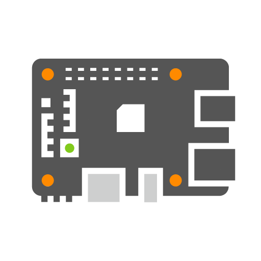

# Download live iso

## Architalia-live ISO

### Introduction

Architalia-live is a live installation for pure Arch created with Archiso. It maintains the philosophy of Arch by preserving manual installation from the console or scripts, but adds a minimal Gnome-shell that includes useful packages for the user.

It is possible to perform a traditional Arch installation in console mode with the possibility to read a guide on the same screen or navigate to check something on Archwiki, or to perform other maintenance operations in chroot on your Arch system. It is of course possible to establish an internet connection in the traditional way with the implementation of the networkmanager service, through Gnome.

All the guides of the Architalia community in PDF format can be found in `~/Guide`. To create your installation, you can use the classic command line method in console mode or use archinstall. For expert users, you can use the Architalia script located in `~/Installscript`. Additional packages in this live version are: git, Firefox, evince, eog, console, nautilus, text-editor, etcher, gparted, gnome-system-monitor, gdm, gnome-shell.

### Download ISO

- `[architalia-2023.07.03-x86_64.iso]`
- `Size 1.59 GB`
- `Beta Version 3.0`
- `linux-6.4.1-arch1-1`

- [Download iso](https://drive.google.com/file/d/1-o2_ax8eva2AkLj7tgjw6nKsH17Pdt95/view?usp=sharing)
- [Github](https://github.com/ArchItalia/architalia-live.git)

  

### Bugs

* [2023.06.30]  [Not Critical]  Long rootfs filesystem  time. 
* [2023.06.30]  [Not Critical]  Long desktop environment boot time. 

    

## Archiso

Always updated, from the Italian server archmirror.it
 
[Download](https://archmirror.it/repos/iso/latest/archlinux-x86_64.iso)

Verification of the signature

It is recommended to verify the signature of the image before use, especially if it has been downloaded from an HTTP mirror where downloads may be subject to interceptions to provide malicious images. On a system with GnuPG installed, run the following command to download the PGP signature ISO > in the directory with the ISO file and verify it with:

`$ gpg --keyserver-options auto-key-retrieve --verify archlinux-version-x86_64.iso.sig`

Alternatively, from an existing installation of Arch Linux, run:

`$ pacman-key -v archlinux-version-x86_64.iso.sig`

    

## VM Image

Official images for virtual machines, the base image is designed for local use and is pre-configured with (user: arch - password: arch) and sshd running.

[Download](https://gitlab.archlinux.org/archlinux/arch-boxes/-/jobs/artifacts/master/browse/output?job=build:secure)

    

## Docker

Official Docker Image

`docker pull archlinux`

[Download](https://hub.docker.com/_/archlinux)

    

## ARM

Arch Linux ARM is a Linux distribution for ARM computers.

[Download](https://archlinuxarm.org/about/downloads)

    
